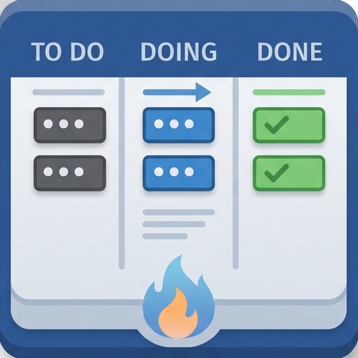

<div align="center">


# TB-Kanban

**A native Kanban board for Thunderbird/Betterbird Tasks**

[](LICENSE.md)
[](manifest.json)
[](manifest.json)

</div>

TB-Kanban turns the tasks you already manage in Thunderbird/Betterbird (VTODO/iCal
items) into a drag-and-drop Kanban board, right inside the mail client. No
external service, no duplicated data — every card *is* a task stored in your
calendar/task backend, read and written directly as jCal.

> Fork of [iCanban](https://github.com/jydidier/icanban-thunderbird) by
> Jean-Yves Didier, rebuilt from the ground up. See [LICENSE.md](LICENSE.md)
> for attribution details.



## Table of contents

- [Features](#features)
- [How it works](#how-it-works)
- [Requirements](#requirements)
- [Installation](#installation)
- [Usage](#usage)
- [Localization](#localization)
- [Building from source](#building-from-source)
- [Project structure](#project-structure)
- [License](#license)

## Features

### Board & task management

- **Four-column board** mapped 1:1 to the standard iCal `VTODO` states:
  *Needs Action*, *In Process*, *Completed*, *Cancelled*.
- **Drag & drop** cards between columns — moving a card updates the task's
  status automatically (and sets/resets `percent-complete` to `100`/`0`
  accordingly).
- **Manual card ordering** within a column via drag & drop, with a live drop
  indicator; the order is persisted in `browser.storage.local` so your layout
  survives a restart.
- **Inline click-to-edit** fields directly on the card — click the title or
  description to edit in place, confirm with the check icon or <kbd>Enter</kbd>,
  cancel with the cross icon or <kbd>Esc</kbd>.
- **Full edit dialog** (pencil icon) to change title, status, priority, start
  date, due date, percent complete and description in one form.
- **Safe delete workflow** — the trash icon first retires a task to
  *Cancelled*; clicking it again on an already-cancelled task asks for
  confirmation and permanently removes it.
- **Progress bar per card**, click to reveal a slider and update
  `percent-complete` (5% steps) without opening the full edit dialog.

### Organization

- **Priority badges** (*None/High/Medium/Low*) with a one-click quick-select
  menu, color-coded for quick scanning.
- **Category badges** populated live from the categories configured in
  Thunderbird, reusing their actual colors (with automatic contrasting text);
  new categories can be added on the fly directly from the board.
- **Category-tinted cards** — a pastel tint of the assigned category's color
  is applied to the whole card for at-a-glance grouping.
- **Swimlane grouping** — group the board by *Category* or *Priority* via the
  toolbar dropdown; lanes render as a collapsible accordion (one lane open at
  a time) with a live task count per lane.
- **Due dates** shown on the card with a calendar icon, formatted using the
  user's locale.

### Integration & UX

- **Two entry points**: a toolbar button and a *Tools → Display Kanban board*
  menu item.
- **Runs in its own contextual identity** (isolated container tab) and reuses
  the existing board tab instead of opening duplicates.
- **Live sync** — the board listens to the calendar's create/update/remove
  events and refreshes automatically, so changes made elsewhere in Thunderbird
  show up without a manual reload.
- **Light/dark theme aware** (`data-bs-theme="auto"`), following
  Thunderbird's own theme.
- **Internationalized UI** driven by `data-i18n` attributes, currently shipped
  in English and German.

## How it works

Thunderbird's public WebExtension API does not expose task CRUD operations or
change events, so TB-Kanban ships a set of custom
[experiment APIs](experiments/calendar) that bridge the internal calendar
backend to `browser.calendar.*`:

| Experiment API | Purpose |
| --- | --- |
| `calendar.items` | Query, update and remove tasks, and subscribe to create/update/remove events |
| `calendar.categories` | Read the categories (name + color) configured in Thunderbird |
| `calendar.calendars` | Enumerate available calendars |
| `calendar.provider` | Registers the extension with Thunderbird's calendar provider |
| `calendarTaskView`, `calendarItemAction`, `calendarItemDetails` | Integration points with Thunderbird's native task UI |

Tasks are exchanged in [jCal](https://www.rfc-editor.org/rfc/rfc7265) format.
[scripts/jcal.js](scripts/jcal.js) is a minimal, dependency-free jCal reader/writer that
extracts and mutates the `VTODO` properties the board needs (`summary`,
`status`, `priority`, `percent-complete`, `due`, `dtstart`, `description`,
`categories`) without pulling in a full ICAL.js library.

## Requirements

- Thunderbird or Betterbird **128 – 145** (see
  [`browser_specific_settings`](manifest.json)).

## Installation

1. Download the latest `.xpi` from the [Releases](../../releases) page (or
   [build it yourself](#building-from-source)).
2. In Thunderbird, open **Add-ons and Themes** (`Ctrl+Shift+A`).
3. Click the gear icon → **Install Add-on From File...** and select the
   downloaded `.xpi`.

For development, load it as a temporary add-on instead:

1. Open `about:debugging#/runtime/this-firefox` (Thunderbird's Debugging
   page).
2. Click **Load Temporary Add-on...** and select the [manifest.json](manifest.json)
   file in this repository.

## Usage

Open the board either via the **Kanban** toolbar button or through
**Tools → Display Kanban board**. Every task from your task-enabled calendars
appears as a card; drag it between columns to change its status, or use the
inline controls to edit priority, category, progress and details.

## Localization

UI strings live under [_locales](_locales). Currently available:

- English (`en`) — default
- German (`de`)

Contributions for additional languages are welcome — copy
[_locales/en/messages.json](_locales/en/messages.json) into a new locale folder and translate
the `message` values.

## Building from source

```
git archive --format=zip -o tb-kanban.xpi <tag-or-branch>
```

See [BUILD.md](BUILD.md) for details.

## Project structure

```
experiments/calendar/   Experiment APIs bridging Thunderbird's calendar to browser.calendar.*
scripts/                Background script and board logic (kanban.js, jcal.js, i18n.js)
ui/                     Board HTML/CSS
vendor/                 Bundled third-party libraries (Bootstrap, DOMPurify, marked) — see VENDOR.md
_locales/               UI translations
```

## License

TB-Kanban is licensed under the **Mozilla Public License 2.0** — see
[LICENSE.md](LICENSE.md) for the full text and third-party attributions, and
[NOTICE.md](NOTICE.md) / [VENDOR.md](VENDOR.md) for bundled dependencies.

